# 实验一 CSR / SSR / SSG 渲染对比

## 一、实验目的

## 二、环境与工具

## 三、任务与自检（含截图）

### 任务一：Vite 纯 CSR（lab1-csr）
（1） pnpm run dev 后 5173 端口能看到 10 篇文章；
（2） 源代码里看不到文章正文；
（3） Network 里能看到 main.js 请求。
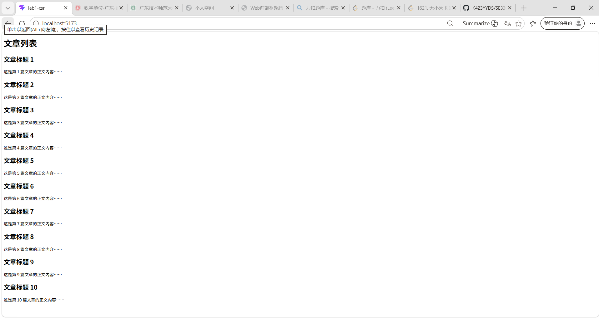

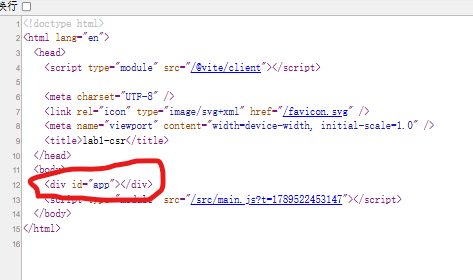

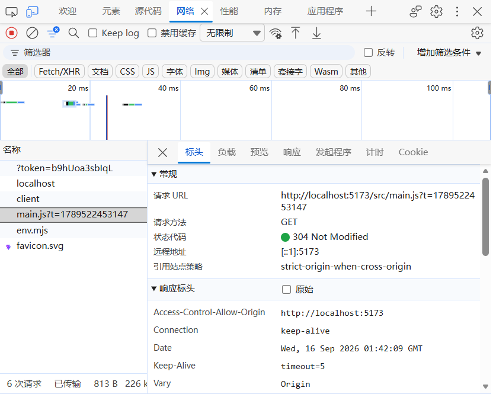

### 任务二：Express SSR（lab1-ssr）
（1） 页面能看到 10 篇文章；
（2）  源代码里含文章正文（SEO 友好）；
（3）  分析代码证明SSR模式中服务器是不是每次接受请求都现拼一遍 HTML？可不可以修改代码使得显式证明一下？比如通过添加时间戳来比较啥的？
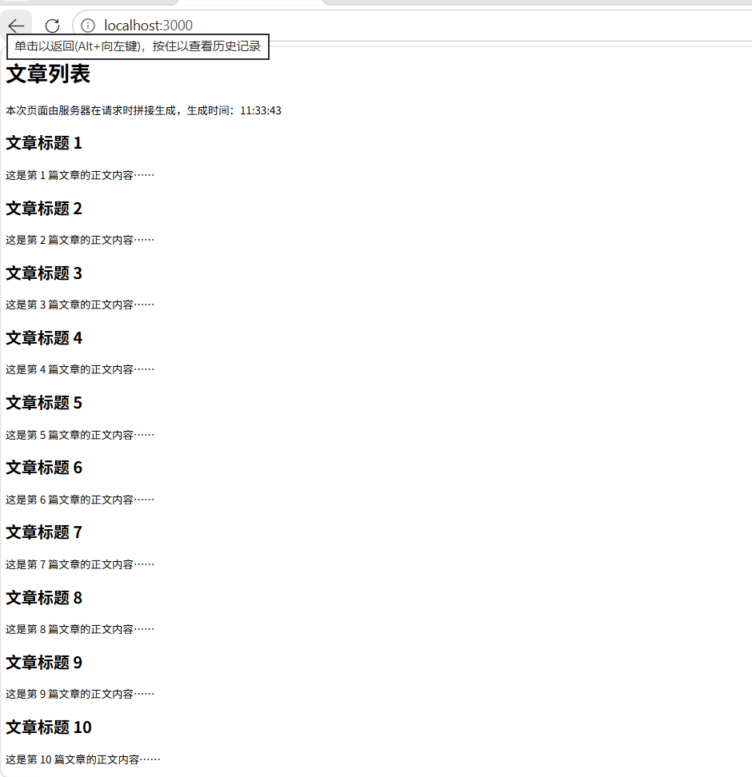

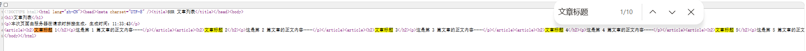

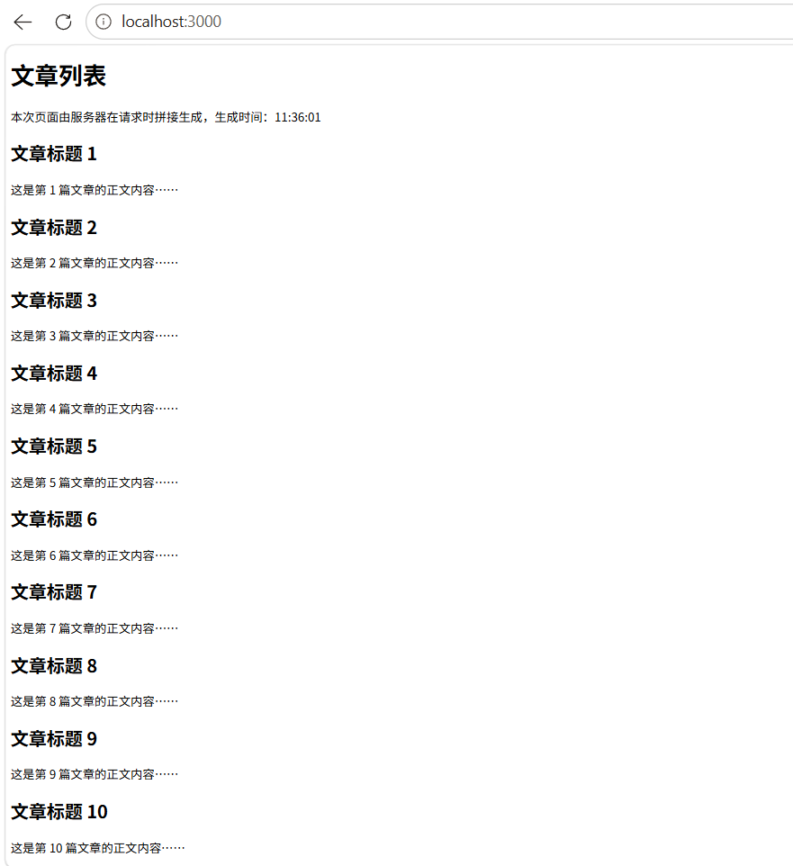

### 任务三：SSG 静态生成（lab1-ssg）
（1） dist/index.html 生成成功；
（2）  本地预览能访问；
（3） 证明：内容在构建时就已经写死在 HTML 里？
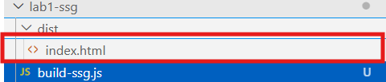

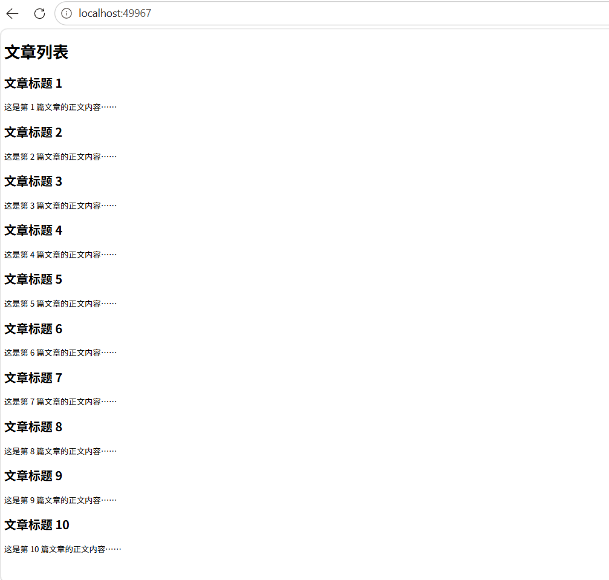

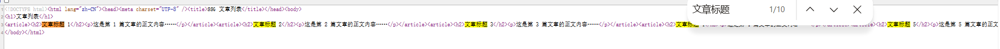

## 四、指标测量与对比

| 模式 | 首屏HTML大小 | 白屏时间(FCP) | LCP | SEO(源码含正文?) | 适用场景 |
|---|---|---|---|---|---|
| CSR | 149B | 0.4s | 0.5s | 无 | 后台管理系统、工具型应用（交互多、需登录，SEO 不重要） |
| SSR | 1.4KB | 0.2s | 0.2s | 有 | 电商、实时内容页（内容要新、又要 SEO） |
| SSG | 580B | 0.2s | 0.2s | 有 | 博客、文档站、营销页（内容稳定，追求最快最稳） |

## 五、提交与部署（三个链接）
- GitHub 公开仓库：https://github.com/k423yyds/se3306-exp1
- CSR 部署：https://se3306-exp1-d4guivrcde64d7f1d-1490142793.tcloudbaseapp.com/csr/
- SSG 部署：https://se3306-exp1-d4guivrcde64d7f1d-1490142793.tcloudbaseapp.com/ssg/
- SSR 部署：ssr-315438-10-1490142793.sh.run.tcloudbase.com

## 六、必答题
### （1）为什么 SPA 时代 SEO 差？
因为 SPA（CSR）的服务器只返回一个空 HTML 骨架（只有一个 `

` 加 JS 引用），正文由 JS 在浏览器运行时才渲染出来。搜索引擎爬虫抓取的是初始 HTML 源码，通常不执行或很少执行 JS，所以源码里没有正文，页面内容无法被索引。本实验 CSR 页面源码只有 149B、不含任何文章正文，就是直接证据。

### （2）SSG 与 SSR 的本质区别是什么？
本质区别是"HTML 在哪一刻生成"。
- SSR：在【每次请求时】由服务器现拼完整 HTML 返回，内容实时，但有服务器计算开销。本实验两次请求的"生成时间"不同（09:14:31 → 09:14:32）就是证明。
- SSG：在【构建期】一次性生成静态 HTML 文件，之后访问只是把文件直接发给浏览器，零计算，最快最稳，但内容更新需要重新构建。本实验 build-ssg.js 在构建期把正文写死在 dist/index.html 里就是证明。

### （3）结合讲次02 渲染模式演进理论，写一段 200 字左右总结
网页渲染大致经历了五个时代：最早的服务器端渲染（整页刷新，交互弱）→ SPA/CSR 时代（JS 接管渲染，交互体验好，但首屏慢、SEO 差）→ SSR 回归（服务端出完整 HTML，保住 SEO 与首屏，但需水合、服务器压力大）→ SSG/ISR（构建期生成静态页，最快最稳；ISR 用 revalidate 定时后台重建，兼顾更新）→ RSC/PPR 等混合渲染（按需服务端渲染 + 客户端交互，取各家之长）。本实验用 Vite、Express、构建脚本亲手实现了 CSR/SSR/SSG 三种模式，并用首屏 HTML 大小、FCP、LCP、SEO 四项指标验证了这条演进线的合理性。

### （4）前三个实验任务都启用了服务器，分别使用什么服务器？三种方式运行机制是怎样？
- 任务一（CSR）：Vite 开发服务器（端口 5173）。开发时提供实时编译与热更新；生产构建后产出纯静态文件（index.html + assets JS），部署后由静态托管平台发文件，浏览器下载 JS 后客户端渲染。
- 任务二（SSR）：Express 服务器（端口 3000）。Node 服务持续运行，每次收到请求都当场把 10 篇文章拼成完整 HTML 返回，属于服务端渲染。
- 任务三（SSG）：静态文件服务器（npx serve / python http.server，端口 49967/8080）。只是把构建期生成的 dist/index.html 当静态文件发出去，零计算。
（注：CSR/SSG 部署后不再需要 Node；SSR 需要持续运行的 Node 服务，所以用 CloudBase 云托管部署。）

### （5）实时更新的股票行情页，三种模式加上 ISR，哪个最合适？为什么？
最合适的是 ISR。理由：股票行情内容变化频繁且希望 SEO 友好、分享有标题摘要——纯 SSG 不行（内容更新需整体重新构建，跟不上行情）；纯 CSR 不行（SEO 差、首屏慢）；SSR 可以每次现拼保证最新，但每次请求都要回源渲染，高并发下服务器压力大。ISR 是 SSG 的补丁：设置 revalidate 间隔（如几十秒），间隔内访问直接返回 CDN 缓存的静态页（最快最稳），过期后第一个请求触发后台重新生成新页面替换缓存，兼顾速度、SEO 与内容新鲜度。若要求毫秒级实时，则 SSR（或加流式）更合适。

### （6）为什么 SSR 需要水合 Hydration？没有水合会怎样？
SSR 返回的 HTML 是服务端拼好的静态页面，只有外观、没有交互能力——事件监听、组件状态都还没绑定。水合就是浏览器加载 JS 后，把这份静态 DOM 重新激活：绑定事件、恢复状态，让页面真正"活"起来。没有水合，页面能看不能点：链接不跳转、按钮无响应、表单不工作，用户面对的就是一张静态网页；但水合也有代价——要下载并执行 JS，会有额外等待时间，这也是 SSR 在性能上需要权衡的原因。

## 七、选答题
### （7）什么条件下 SSG 是最优解？内容更新频繁时如何补救？
SSG 的最优条件是：内容基本不变或更新不频繁、以读为主、追求极致的首屏速度与稳定性、又需要 SEO——典型如博客、文档站、营销页、产品介绍页。本实验 SSG 首屏 HTML 580B、FCP/LCP 均 0.2s，是三种模式里最快最稳的，正是这种场景。内容更新频繁时用 ISR 补救：为页面设置 revalidate 间隔（如 60 秒），访问时先返回 CDN 缓存的旧静态页，超过间隔后第一个请求在后台重新生成新页面并替换缓存，这样既保留静态页的速度与 SEO 优势，又允许内容定期更新，代价是更新有延迟、架构更复杂（需要构建平台支持增量生成）。

## 八、Debug FAQ（本次实验真实遇到的坑）

### 1. git push 报错 `Repository not found`
现象：`fatal: repository 'https://github.com/k423yylds/se3306-exp1.git/' not found`
原因：GitHub 用户名打错（k423yylds 应为 k423yyds），远程仓库地址不存在。
解决：核对 GitHub 实际用户名，修正后重新 push。
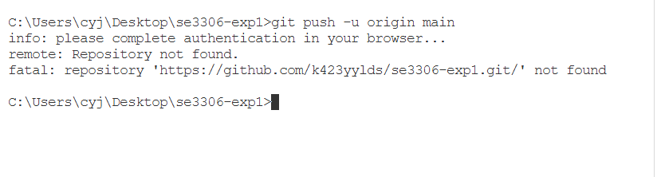

### 2. Vite 构建成功，但部署到 /csr/ 子目录后白屏
现象：`pnpm build` 构建成功（dist/index.html 0.38 kB），但部署后打开 https://域名/csr/ 一片空白。
原因：Vite 默认产物引用绝对路径 `/assets/index-xxx.js`，部署在子目录 /csr/ 时，浏览器去域名根目录找 /assets/ 返回 404，JS 加载失败导致白屏。
解决：用 `pnpm build --base=./` 重新构建，产物路径变成相对路径 `./assets/...`，重新上传即可。
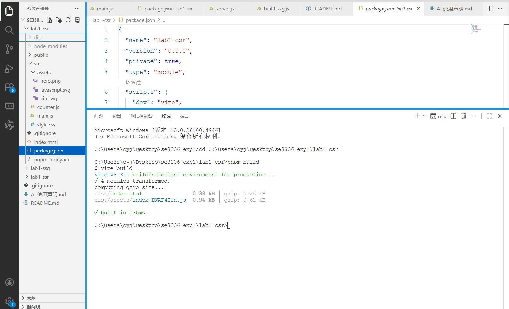
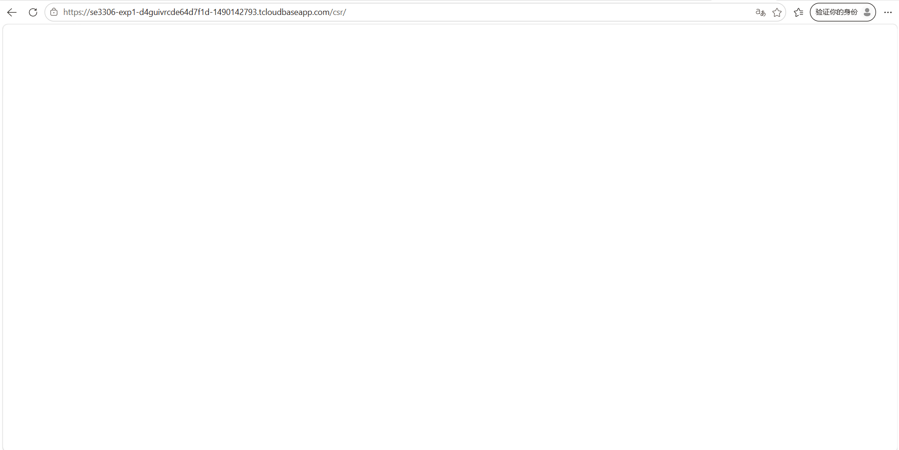

### 3. CloudBase 云托管构建失败（EBADDEVENGINES）
现象：云托管部署版本 001 构建失败，日志报 `npm error EBADDEVENGINES ... required: { name: 'pnpm', version: '12.4.2' }`。
原因：pnpm 12 在 package.json 里写入了 `devEngines` / `packageManager` 字段，而云托管自动生成的 Dockerfile 用 `npm install` 装依赖，npm 11 检测到 packageManager 不匹配，直接拒绝安装。
解决：删除 package.json 中的 `devEngines` 和 `packageManager` 字段，commit 推送后重新部署。
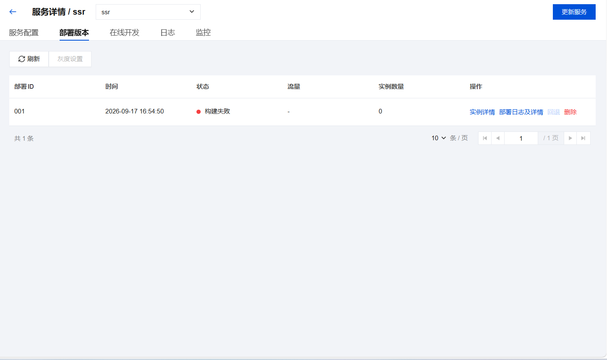

## 九、实验体会
通过亲手实现 CSR/SSR/SSG 三种模式并实测数据，我直观理解了它们的差异：CSR 是"空壳 + JS 运行时渲染"、SSR 是"每次请求现拼 HTML"、SSG 是"构建期写死正文"。实测数据（首屏 HTML 149B/1.4KB/580B，FCP 0.4s/0.2s/0.2s）让理论课上"五个时代"的演进有了实证支撑。同时学会了 Git 版本管理、静态托管与云托管的区别（CSR/SSG 用静态托管，SSR 必须持续运行 Node 服务）、以及用 Lighthouse 测 Web Vitals。遇到 pnpm/模块类型/Vite 路径等坑时，"报错第一行 + 目录对不对 + 依赖装没装"的三查口诀很管用。
